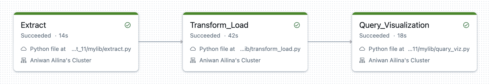
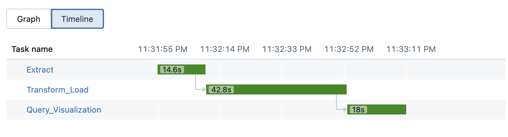
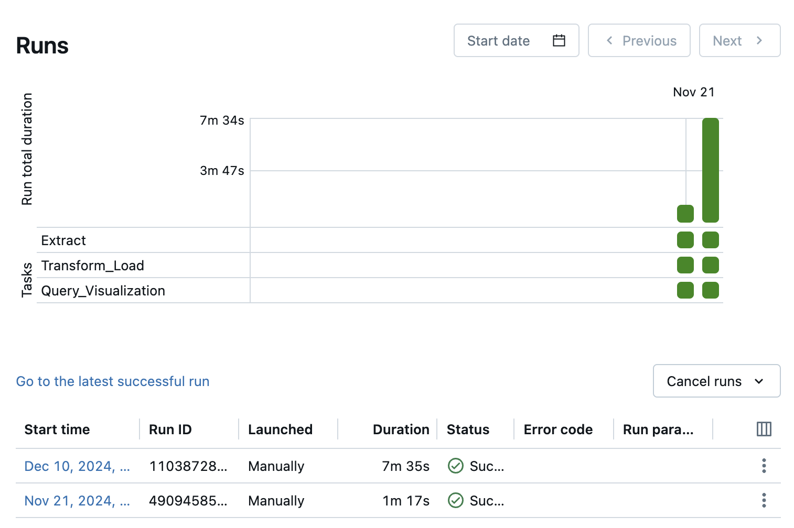

[](https://github.com/ailina-aniwan/Ailina_Aniwan_Mini_Project_11/actions/workflows/cicd.yml)
# IDS706 - Mini Project 11 - Ailina Aniwan

## Data Pipeline with Databricks

## Overview
This project implements a data pipeline using Databricks to process and analyze the *Student Lifestyle Dataset*. The pipeline consists of three main phases: Extract, Transform & Load, and Query & Visualization. Each stage leverages Databricks capabilities, including Spark and Delta Lake, to ensure scalable data processing and insightful analysis.

## Pipeline Architecture

### Workflow Stages
1. Extract:
- Source: Public CSV file retrieved from the GitHub URL.
- Action: The file is uploaded to the Databricks FileStore (`dbfs:/FileStore/mini_project11`).
- Script: `mylib/extract.py`
2. Transform & Load:
- Action: The dataset is read into a PySpark DataFrame, transformed with unique identifiers, and stored as a Delta Lake table (`student_lifestyle_delta`).
- Script: `mylib/transform_load.py`
3. Query & Visualization:
- Query: SQL is used to calculate average GPA and social hours grouped by stress level.
- Visualization: Boxplot and bar chart are generated to provide insights into the queried data.
- Script: `mylib/query_viz.py`

### Pipeline Diagram


### Timeline of Execution




## Setup Instructions
### Prerequisites
1. Install Python dependencies:
  ```bash
  pip install -r requirements.txt
  ```
2. Configure environment variables in a `.env` file:
  - ACCESS_TOKEN: Databricks access token
  - SERVER_HOSTNAME: Databricks server hostname
  - JOB_ID: Databricks job ID (for triggering jobs)

### Running the Pipeline
1. Extract: This will download the dataset and store it in dbfs:/FileStore/mini_project11.
  ```bash
  python mylib/extract.py
  ```
2. Transform & Load: This step reads, processes, and stores the data as a Delta Lake table.
  ```bash
  python mylib/transform_load.py
  ```
3. Query & Visualization: This step runs SQL queries and generates visualizations:
  ```bash
  python mylib/query_viz.py
  ```
